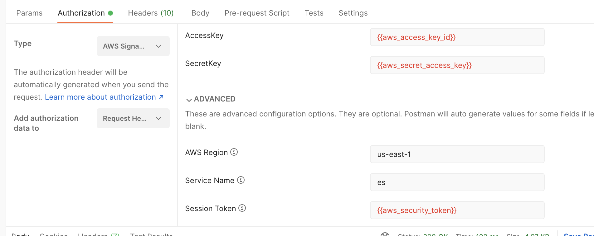

# Ini-As-Rest

### Serve AWS credentials file as JSON

A local http web-server to serve AWS credentials to be used where need.
For example, in a postman request (`Pre-request Scripts`), See here:
[https://github.com/postmanlabs/postman-app-support/issues/3103](https://github.com/postmanlabs/postman-app-support/issues/3103)

```sh
USAGE:
    ini-as-rest [OPTIONS]

OPTIONS:
    -h, --help             Print help information
    -p, --port <PORT>      [default: 9432]
    -t, --token <TOKEN>    [default: NONE]
````

## Security Token

```sh
./ini-as-rest --token 3456
```

Will only accept request with that specific token mentioned.
So:

```sh
curl  -i "http://localhost:9432/aws-profile?token=3456"
```
Will work, however, this:

```sh
curl  -i "http://localhost:9432/aws-profile"

```

Will result in an HTTP 401 error.


## Usage for Postman

###AWS Auth Example:


###Pre-request Script:

```js
pm.sendRequest("http://localhost:9432/default?token=01234",
    function (_, response) {
        if (response.status == "OK") {
            const body = response.json()
            pm.environment.set("aws_access_key_id", body.aws_access_key_id)
            pm.environment.set("aws_secret_access_key", body.aws_secret_access_key)
            if (body.aws_security_token) {
                pm.environment.set("aws_security_token", body.aws_security_token)
            }
            return
        } else {
            throw new Error(response.text() || "unknown error fetching aws credentials")
        }
    }
)
```

### Start local web server:

```sh
./target/release/ini-as-rest --token 89273984823784
ini-as-rest
Avner Cohen <israbirding@gmail.com>
Serve AWS Credentials as local webserver, for Postman.

USAGE:
    ini-as-rest [OPTIONS]

OPTIONS:
    -h, --help             Print help information
    -p, --port <PORT>      [default: 9432]
    -t, --token <TOKEN>    [default: NONE]
```


### Build Locally

```sh
make release
```

# Copyright

Copyright (c) 2022 [Avner Cohen](https://github.com/AvnerCohen) [@avnerner](http://twitter.com/avnerner). See [LICENSE](LICENSE.txt) for further details.